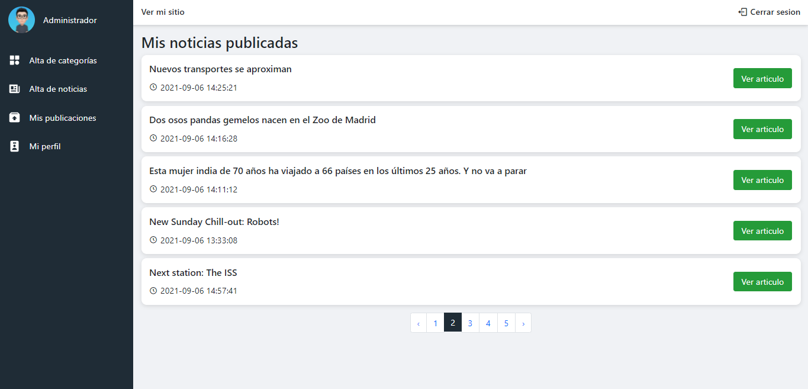

# HCNews - Sitio web de noticias
Este proyecto fué desarrollado con el framework Laravel 8, consiste en dos partes, la primera es un sitio público donde se visualizan todas las noticias publicadas, y por otra parte el panel de administrador el cual gestiona las noticias.

# Capturas

* ## Sitio público:
Home del sitio donde se visualizan las noticias publicadas recientemente.

En la parte superior se ven las categorías con las que cuenta el sitio, en cada una de ellas se ven las noticias o artículos correspondientes.

En este apartado se muestra la noticia completa con los detalles de publicación.

Sección de comentarios, establecida en la misma página de los detalles de la noticias.
Un usuario puede escribir un comentario el cual solo tiene como requerido el mensaje; su nombre e email es opcional y que al dejarse vacio el campo de nombre el mensaje se muestra anonimo.

* ## Panel administrativo

Los usuarios administradores tendrán acceso al login para acceder a gestionar su cuenta.

Ya dentro, se visualiza el grupo de categorías y las categorias. Los grupos de categorías contienen diversas categorías, y en este caso el gupo de categoría "Noticia" contiene diferentes categorías que son mostradas en el sitio público.

Apartado para dar de alta un grupo de categoría o tambien puede ser llamada como una categoría padre.

Edición del nombre del grupo de categorías.

Apartado para dar de alta una categoría y asignación de un grupo de categoría.

Edición de la categoría.

Apartado para la creación de una noticia o artículo.

En esta parte se ve un listado de todas las noticias que se han publicado.

Esta es una vista previa del artículo con todos los detalles y opciones para editar o eliminar.

Apartado donde se edita la noicia y se pueden ver los comentarios con los que cuenta la misma.

El administrador tiene la opción de dar ban a comentarios a cada artículo o de la misma forma quitar el ban.
Esta función se ve reflejada en el sitio público, donde solamente son mostrados los comentarios que no están baneados.

Apartado para que el administrador edite todos sus datos o pueda cambiar su contraseña.

